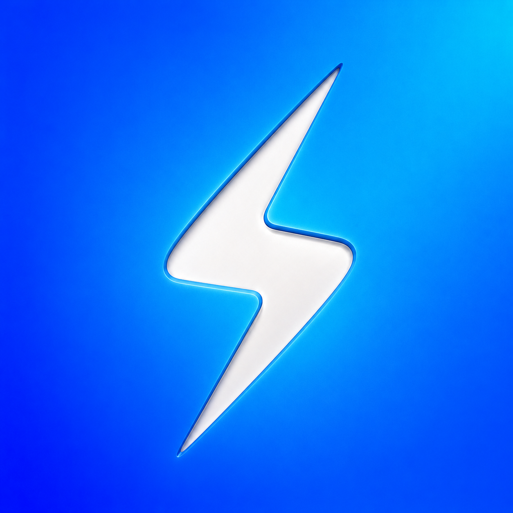
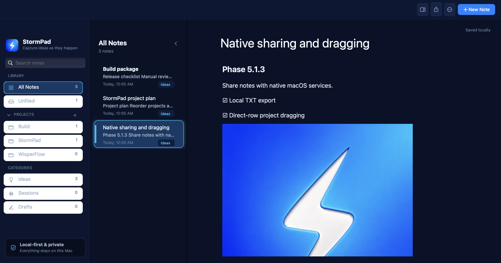

<div align="center">



# StormPad

**A local-first macOS notepad for capturing ideas as they happen.**

[Website](https://mattferre95.github.io/StormPad/) ·
[Download beta](https://github.com/mattferre95/StormPad/releases/download/v0.1.2-beta.2/StormPad-0.1.2.dmg) ·
[Releases](https://github.com/mattferre95/StormPad/releases)

**Public Beta · Apple Silicon · macOS 13+ · [MIT License](LICENSE)**

</div>



## Public beta notice

StormPad 0.1.2 is an independent public beta for Apple Silicon Macs running
macOS 13 or later. The application is unsigned and has not been notarized by
Apple. macOS may block its first launch.

StormPad is not distributed through the Mac App Store, and Apple has not
reviewed or verified this beta.

## Why StormPad

StormPad is a native AppKit and PyObjC application built for immediate capture
without an account or service dependency.

- Notes stay on your Mac as readable Markdown.
- New workspaces begin with one editable Welcome to StormPad note that
  demonstrates headings, formatting, lists, links, organization, sharing, and
  local storage. It can be edited, moved, renamed, or deleted like any other
  note.
- Projects, pinned notes, global search, and categories keep ideas organized.
- A block-based editor supports prose, to-dos, lists, headings, quotes, links,
  images, and files.
- There is no account, cloud sync, telemetry, advertising, subscription, or
  external AI dependency.
- Native macOS sharing sends readable copies through services you choose.

## Download and installation

[Download StormPad 0.1.2 Public Beta](https://github.com/mattferre95/StormPad/releases/download/v0.1.2-beta.2/StormPad-0.1.2.dmg)

1. Download `StormPad-0.1.2.dmg`.
2. Open the DMG.
3. Drag StormPad into Applications.
4. Open StormPad from Applications.

### macOS blocked the app?

Because this beta is unsigned and not notarized, macOS may prevent the first
launch:

1. Try opening StormPad once.
2. Open System Settings.
3. Go to Privacy & Security.
4. Scroll to Security and click Open Anyway.
5. Confirm by clicking Open.

Only follow these steps when StormPad was downloaded from the
[official website](https://mattferre95.github.io/StormPad/) or
[official GitHub repository](https://github.com/mattferre95/StormPad).

## Features

- Native three-column macOS interface
- Local filesystem-backed Projects and Unfiled notes
- Pinned notes, global search, categories, and project icons
- Block-based editing with to-dos, lists, headings, quotes, links, images, and files
- Bold, italic, underline, semantic text colors, and highlights
- Native undo and redo, autosave, export, Finder actions, and Speak Selection
- Note and Project sharing through native macOS services
- Dragging notes between Projects and reordering Projects
- Storm Blue, Light, and Deep Dark themes
- Reduced Motion support

## Local storage

Notes and attachments remain in:

```text
~/Documents/StormPad/
├── Notes/
│   ├── my-business-plan.md
│   └── Projects/
│       └── build/
│           ├── .stormpad-project.json
│           └── editor-plan.md
└── Attachments/
    └── <stable-note-id>/
        ├── moodboard.png
        └── brief.pdf
```

Notes use standard Markdown where possible. Stable IDs, metadata, managed
attachments, and the small allow-listed representation for semantic colors are
documented in [docs/storage.md](docs/storage.md).

Packaging, installation, and updates do not move or upload your notes.

## Sharing from Mac to iPhone

StormPad uses the native macOS Share menu. A note can be sent as a readable TXT
file through AirDrop, Messages, or Mail.

After AirDropping the TXT file to an iPhone, you can manually open it or share
it into Apple Notes. This is a manual transfer, not automatic Apple Notes
synchronization and not cloud sync.

## Development

Development requires macOS and Python 3.12.

```bash
python3.12 -m venv .venv
source .venv/bin/activate
python -m pip install -e '.[dev]'
python -m stormpad
```

The convenience launcher performs the same environment setup when needed:

```bash
./scripts/run.sh
```

StormPad uses native AppKit views through PyObjC. Please preserve that
architecture when proposing changes.

## Verification

Run the headless test and static verification suite:

```bash
python -m pytest
python -m ruff check .
python -m compileall -q stormpad scripts tests
```

Additional native checks are available on a logged-in macOS session:

```bash
python -m stormpad --self-check
python -m stormpad --smoke
python scripts/native_interaction_smoke.py
```

Tests and native smoke checks use temporary fixtures. Never use personal notes
or attachments in test fixtures or screenshots.

## Local packaging

The beta package targets Apple Silicon and macOS 13 or later. Release
dependencies are pinned separately from the development environment:

```bash
python3.12 -m venv .release-venv
./.release-venv/bin/python -m pip install -r requirements-release.txt
STORMPAD_RELEASE_PYTHON=.release-venv/bin/python ./scripts/build_app.sh
./.release-venv/bin/python scripts/verify_package.py
./scripts/build_dmg.sh
```

This produces:

```text
dist/StormPad.app
dist/StormPad-0.1.2.dmg
```

Local packages are unsigned and not notarized. Building a package does not
read, move, or include user notes.

## Documentation

- [Architecture](docs/architecture.md)
- [Storage format and migration](docs/storage.md)
- [Sanitized screenshot fixtures](docs/screenshots/README.md)
- [Product website notes](site/README.md)

## Contributing

Contributions are welcome. Read [CONTRIBUTING.md](CONTRIBUTING.md) before
opening a pull request. Keep changes focused and preserve StormPad's native,
local-first, privacy-respecting design.

## Security

Do not report vulnerabilities through a public issue. Follow
[SECURITY.md](SECURITY.md) and use
[GitHub private vulnerability reporting](https://github.com/mattferre95/StormPad/security/advisories/new).

## Privacy

StormPad has no account, cloud sync, telemetry, analytics, advertising, data
sale, or external AI dependency. Notes remain on your Mac in
`~/Documents/StormPad/`.

Sharing occurs only when you invoke a native macOS Share action and select a
service.

## License

StormPad is available under the [MIT License](LICENSE).

Copyright (c) 2026 Matt Ferré
